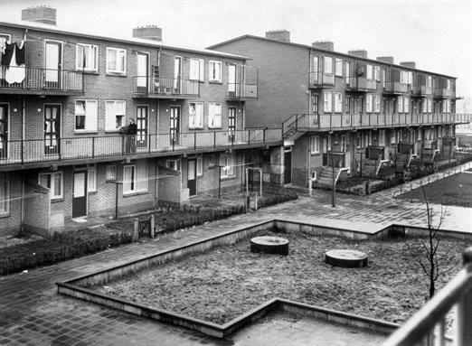

De panden in Buurland zijn gebouwd vlak na de oorlog, eind jaren 40. Omdat er naast een woningtekort ook een grondstoffentekort was, werd er wat bezuinigd op materiaal. Dat is onder andere te merken aan de bakstenen; die zijn hol om grondstof te sparen.

Een kleine duik in het Utrechts Archief toont ons een aantal oude foto's van Buurland! De één is van de aanbouw in 1947 (vlak na de oorlog - er was grote woningnood en te kort aan materialen. Dit is waarom de panden in Buurland gemaakt zijn met holle bakstenen met een staalconstructie erdoor) De tweede is van de binnentuin van Blok A. Destijds waren er kleine tuintjes bij de woningen, plus een gezamelijke binnenplaats met speeltuin en zandbak. Later hebben de bewoners er voor gekozen om grotere eigen tuinen te krijgen, ten koste van die gezamelijke plaats. Buurland brengt het originele concept dus weer terug in de buurt! 

