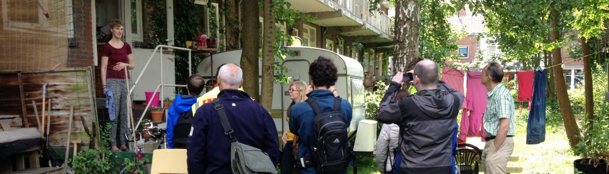

[Nieuw Utrecht](https://www.facebook.com/NieuwUtrecht) heeft de bezoekers van [Culturele Zondagen](https://www.facebook.com/culturelezondagen) afgelopen weekend laten [#‎omfietsen‬](https://www.facebook.com/hashtag/omfietsen?source=embed) buiten de gebaande paden met rondleidingen langs Westplein, Zijdebalen, de werkspoorkathedraal en natuurlijk Buurland Utrecht!

Wist je dat ook de [Utrechtse Ruimtemakers](https://www.facebook.com/utrechtseruimtemakers) en [Paulus Jansen](https://www.facebook.com/pages/Paulus-Jansen/177743948940938) (Wethouder Ruimtelijke Ordening) aanwezig waren tijdens deze rondleidingen? Op twitter noemde hij ons "Gezellig Anarchistisch"

Benieuwd wat er verteld werd tijdens het omfietsen? Een deel van de presentaties zijn door Nieuw Utrecht vastgelegd op video. [Bekijk 't hier](http://www.youtube.com/watch?v=Im-5a2pPNrY)!



