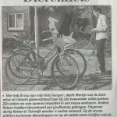

 

"Wat heb ik nou aan mijn fiets hangen", dacht Martijn van Zuidwind uit Utrecht gisterochtend toen hij zijn tweewieler wilde pakken. Zijn stalen ros was opeens veranderd in een heuse eenhoorn. Andere fietsen hadden bijvoorbeeld een giraffenkop gekregen. Ongeveer 30 fietsen in Tuinwijk werden 's Nachts versierd.  [Meer lezen →](http://www.buurlandutrecht.nl/wp-content/uploads/2013/09/dierenfiets.jpg)
