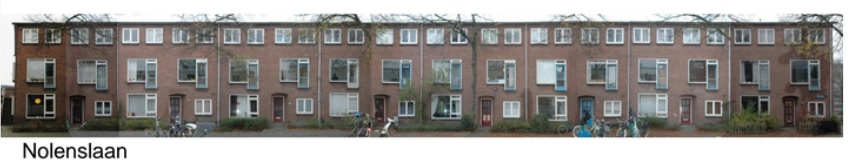
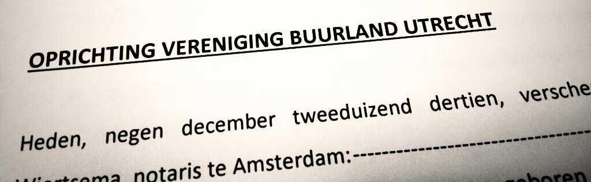

## Een korte geschiedenis
Wist je dat Buurland bijna een permanente status had gekregen? Er waren vergevorderde plannen om de panden over te nemen en in zelfbeheer op te knappen. Benieuwd hoe dat zit? Lees hieronder verder!

### Tijdelijke bewoning voorafgaand aan sloop (2005)
Begin van deze eeuw, na ruim 60jr permanente bewoning, ontstaat bij Mitros het idee om de panden te slopen. Er worden plannen gemaakt voor nieuwbouw. Zoals gebruikelijk op veel plekken, worden de oorspronkelijke bewoners stap-voor-stap vervangen voor tijdelijke bewoners met een anti-kraak-contract (relatief veel woning voor een acceptabele prijs, met als belangrijkste 'catch' dat je ieder moment te horen kan krijgen dat je er over een paar maanden uit moet). De woningmarkt was ook toen al krap. Voor studenten en starters was dit een prima huisvestingsdeal!   

### Permanent tijdelijk? (2008)
Een financiele crisis gooit roet in het eten: Van bouwen is landelijk geen sprake, de geplande einddatum wordt voouit geschoven met een maand of zes. Tot groot genoegen van de nieuwe, tijdelijke bewoners. Bewoners worden buren, en buren maken plannen om hun omgeving beter te maken.   
In de wetenschap dat de panden binnen afzienbare tijd met de grond gelijk gemaakt gaan worden, worden de plannen grootser en gewaagder. Er wordt een [zwembad](/buurtinbeeld/zwembad/) gegraven, [achtergevels worden beschilderd](/buurtinbeeld/gevels/) en er worden plannen gemaakt voor een [buurtfestival](/zwemfest/2010). Dit alles is de voedingsbodem waarop in 2010 "Buurland Utrecht" ontstaat.  
De bewoners kunnen hun geluk niet op als de einddatum keer-op-keer geschoven wordt. Een tweede, en later zelfs een derde editie van [Zwemfest](/zwemfest/) zien het levenslicht. Het lijkt wel of deze tijdelijkheid permanent blijft!

### Mitros komt voor een keuze (2012)
Omdat de panden gesloopt zouden worden, is er weinig aan groot onderhoud gedaan. Mitros komt voor een keuze te staan: Toch slopen, of investeren in een opknapbeurt voor de komende zeven jaar? Diverse Buurland-bewoners besluiten hierop invloed uit te willen oefenen... 

---

## 2012-2014: Vereniging buurland!
Met een steeds krappere woningmarkt, worden concepten als 'Collectief Particulier Ondernemerschap', 'Zelfbouw' en 'Klushuizen' _hot item_ in woningbouwland. Ook Mitros beraadt zich op een alternatief voor de 'buurland-panden'. Met ondersteuning van Jasper van de Wal (van Nimwegen) werken diverse buurtbewoners aan een plan om de panden van Buurland te redden van de sloop, in zelfbeheer op te knappen. Vereniging Buurland ziet het levenslicht! 

Onze droom: 
1. Betaalbaar wonen in een gerenoveerd, duurzaam en gemoedelijk Buurland
2. Gemeenschappelijke binnen- en buitenruimtes ter bevordering van de sociale cohesie

Om deze droom te verwezelijken is er een [organisatiestructuur](/vereniging-buurland/verenigingsstructuur/) opgesteld, zijn de [visie, missie, doelstellingen](/vereniging-buurland/missie-visie-doelstellingen) geformuleerd. Dromen en wensen zijn geconcretiseerd in [conceptplannen](/vereniging-buurland/conceptplannen/), er zijn [kostenramingen](/vereniging-buurland/kostenraming/) opgemaakt voor renovatie door architect (Ineke Hulshof) i.s.m.  Adviesbureau Van Nimwegen, er lopen gesprekken met Mitros, SSH, provincie en gemeente. 

## 7 jaar later; nieuwe tijdelijkheid.
Het is 2020. De zeven stabiele jaren zijn ten einde. ook nu is wederom onzeker wanneer de sloop daadwerkelijk gaat starten. De huidige bewoners starten een nieuw offensief om Buurland te behouden: [buurland: met hoop op de toekomst](/berichten/20201016-toekomst/)
 

